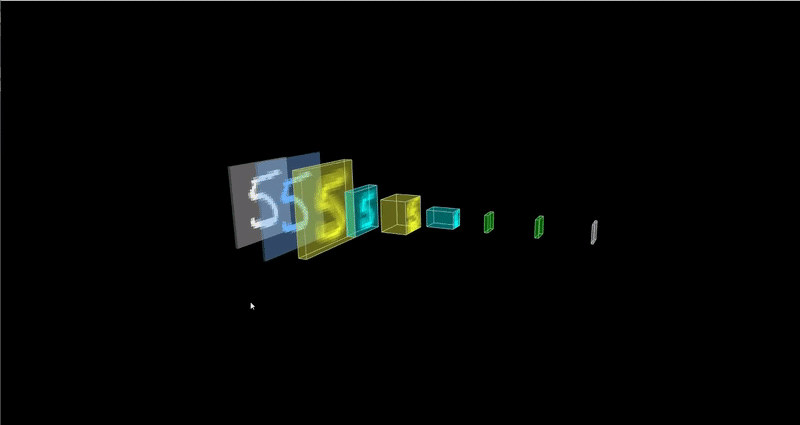
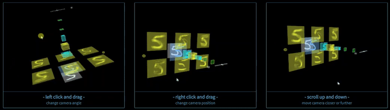
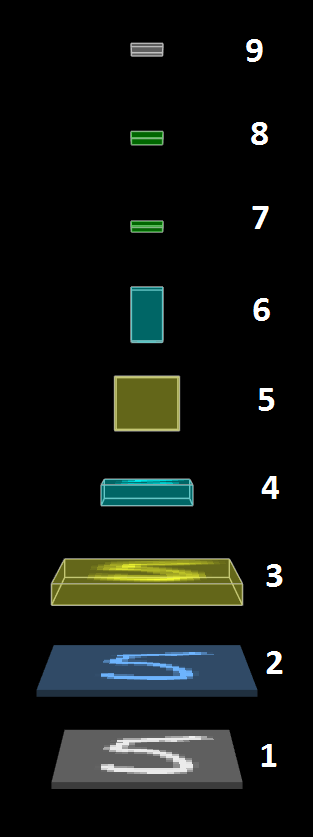

## Hello Tensorspace

<br>
<b>Click me to explore the model structure.</b>

## Resources
- Check out the website to explore and play with other models.
- <a href="https://github.com/tensorspace-team/tensorspace" target="_blank">Tensorspace - Github</a>
- <a href="https://tensorspace.org/index.html" target="_blank">Tensorspace - Website</a>

## Model Structure
The default view of the model structure is as shown below with corresponding labeled layers.<br>

```javaScript
  const model = new TSP.models.Sequential(modelContainer);
 
  //Order corresponds with the image above default view
  model.add( new TSP.layers.GreyscaleInput({ shape: [28, 28, 1] }) );            //1
  model.add( new TSP.layers.Padding2d({ padding: [2, 2] }) );                    //2
  model.add( new TSP.layers.Conv2d({ kernelSize: 5, filters: 6, strides: 1 }) ); //3
  model.add( new TSP.layers.Pooling2d({ poolSize: [2, 2], strides: [2, 2] }) );  //4
  model.add( new TSP.layers.Conv2d({ kernelSize: 5, filters: 16, strides: 1 }) );//5
  model.add( new TSP.layers.Pooling2d({ poolSize: [2, 2], strides: [2, 2] }) );  //6
  model.add( new TSP.layers.Dense({ units: 120 }) );                             //7
  model.add( new TSP.layers.Dense({ units: 84 }) );                              //8
  model.add( new TSP.layers.Output1d({                                           //9
    units: 10, 
    outputs: ["0", "1", "2", "3", "4", "5", "6", "7", "8", "9"]
  }) );
```